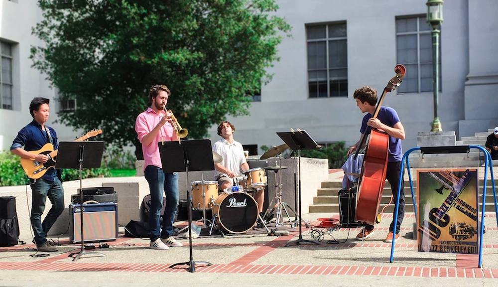
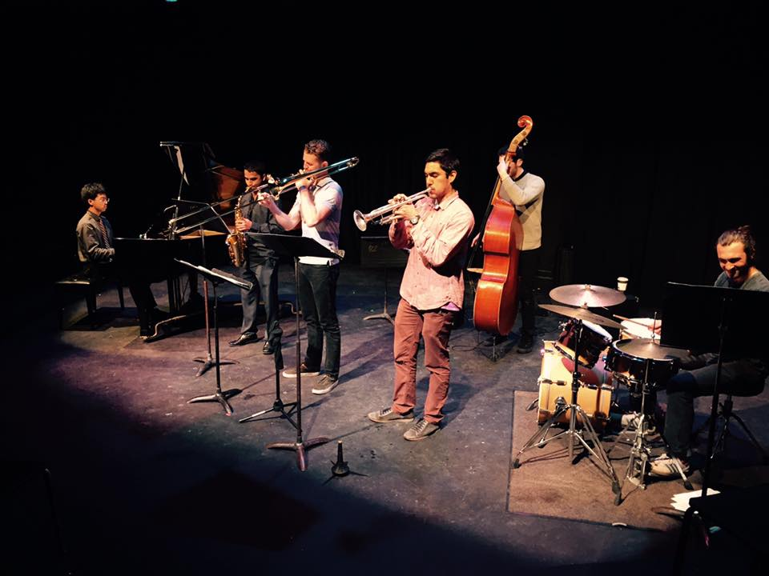
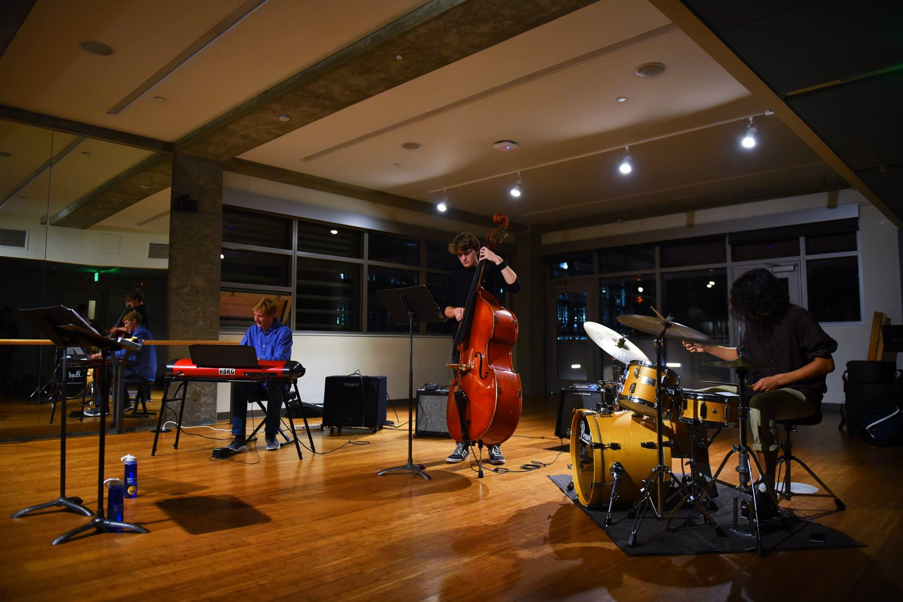

## Combo Groups

#### Advanced Combos

Advanced combos consist of the top players in UC Jazz Ensembles. Placement in these combos is restricted. The advanced combos perform jazz standards, challenging and contemporary material such as Dave Liebman and Chick Corea, and original compositions. Advanced musicians should have a thorough understanding of bebop and contemporary improvisation styles, and a familiarity with the musical languages of Charlie Parker, Miles Davis, John Coltrane, Wayne Shorter, Bill Evans, etc. Students should know diatonic and non-diatonic jazz harmonic theory and have memorized several jazz standards. They should have technical fluency on their instrument and possess advanced jazz musicianship skills, including sight-reading, transposition, odd-meter playing, and pitch/chord recognition, although the combos will continue to work in all of these areas. Advanced combos frequently perform at highly visible venues on and off campus and perform biannually at our end of semester concerts.

#### Intermediate Combos

Intermediate combos work on improvisation skills and focus on standard repertoire including tunes like "On Green Dolphin Street," "Confirmation," "All the Things You Are," etc. These musicians should have a good facility on their instruments and know the fundamentals of jazz harmony, including diatonic modes and common chord progressions. They should understand the swing feel and be able to improvise over forms such as the twelve-bar blues. These students usually have participated in high school or college groups.

#### DeCal Combos

The DeCal Jazz Combos are student taught combos/courses which are intended for students who want to learn jazz, but have limited experience or come from different musical backgrounds. At the each of semester a noon concert will be held, depending on how far the students have progressed. Students are encouraged to audition for the intermediate combos after taking one or two semesters of the Beginning Jazz Combos.

To join this group, you must audition on an instrument of your choice - to demonstrate basic musical proficiency. We will ask you to play a few major scales, do some simple sight-reading, and play a prepared piece of your choosing. Students who do well in these may be assessed further, with lower and advanced sections within these combos. Some people may have had high school experience in jazz, or come from a relatively high level of musicianship with a classical background.

Auditions take place in 74 Cesar Chavez (basement of Cesar Chavez where UC Jazz and Student Musical ACtivities are located.). There will be a sign-up sheet on a bulletin board outside the room. Please take note of the time you sign up.

Rehearsal times are typically MWT 7-9, with each day corresponding to a different section, but we only set this concretely after auditions have taken place. Instrumentation typically consists of piano, bass, drums, guitar, saxophone, trumpet, clarinet, trombones, with flexibility of including strings, vocalists, and other instruments.

The group involves listening assignments, performance, history, theory, and composition. We would like to make the class social and form a community of sorts, so outside collective music practicing is highly encouraged. Participants will be considered members of UC Jazz and Student Musical activities, and will gain acess to practice rooms with the ability to reserve space for rehearsals. UC Jazz members must pay dues of $85 per semester of membership.

#### Cal Alumni Big Band

The Cal Alumni Big Band was established in 1980 with the intent of providing Cal grads and alumni of the Jazz Ensembles an outlet for playing big band music after leaving UC Berkeley. The band is open to talented musicians from all over the Bay Area but traditionally the vast majority of players are Cal grads. Check out the rehearsal if you would like to sit in and be a part of the band. The big band is managed by <a href="mailto:slind@stmarys-ca.edu">Sam Lind</a>. 