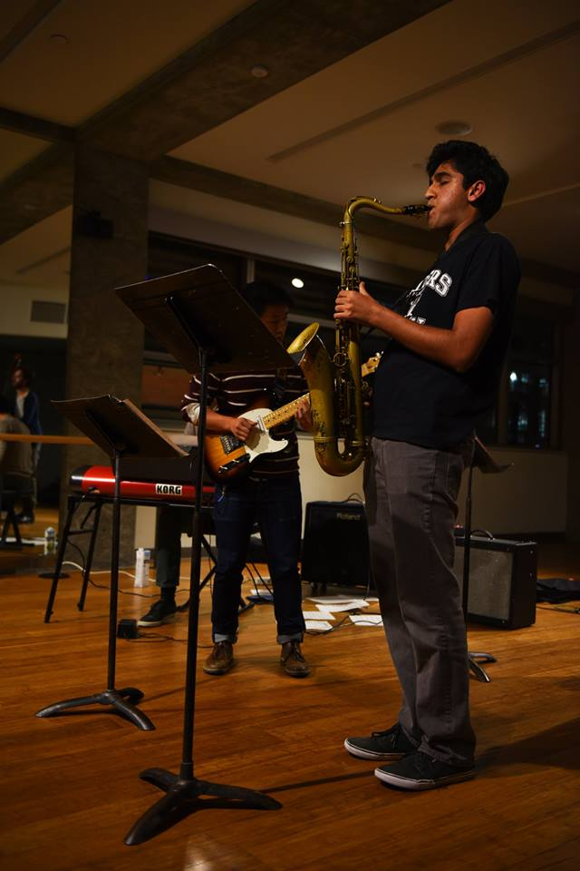

## Fall 2018 Auditions
UC Jazz auditions for the <a href="datebook.html">2018/2019 school year</a> will be held on:
* Monday, Aug 27  10am-4pm
* Tuesday, Aug 28  10am-4pm
* Wednesday, Aug 29  10am-2pm

## Audition Requirements

UC Jazz holds individual auditions for all new members. The list of audition requirements is intended to be comprehensive and to represent all levels of experience, and we know that not everyone will be able to fulfill all of the audition requirements. Come prepared to demonstrate as many of the requirements as possible. This will help us to determine which level is appropriate for you.

#### All Horns, Piano, Guitar, Vibes

<ul>
	<li>Scales: all major, minor scales (Dorian), and all dominant 7th + Lydian Dominant 7th</li>
	<li>Sight-reading: material selected by instructors</li>
	<li>Impovisation: play along with a recorded track (Abersold); you can choose from a list of standards</li>
</ul>

#### Piano, Guitar, Vibes

<ul>
	<li>Comping: demonstrate comping technique on all the above styles by playing through changes</li>
	<li>Latin comping: demonstrate comping technique by playing through changes on a Latin tune</li>
</ul>

#### Bass

<ul>
	<li>Demonstrate walking through blues and rhythm changes (in the combo)</li>
	<li>Demonstrate walking through any standard tune of your choice in the Real Book (in the combo)</li>
	<li>Demonstrate example of the following grooves: funk, samba, generic latin (either in the combo or individually)</li>
	<li>Sight-reading: material selected by instructors</li>
</ul>

#### Drums

<ul>
	<li>Knowledge of all rudiments; you will be asked to play 3 of them (individually)</li>
	<li>Demonstrate knowledge of swing, rock, samba, bossa nova, salsa, generic latin, jazz waltz grooves (individually)</li>
	<li>Brushes: demonstrate swing and straight 8th-note grooves (individually)</li>
	<li>Meters (individually): Samba in 3/2, Funk in 7/4, Latin in 12/8</li>
	<li>Soloing: trade 4's in blues form and samba tune (in the combo)</li>
	<li>Sight-reading: big band chart selected by instructors (individually)</li>
</ul>

#### Optional

<ul>
	<li>For extra consideration (especially for advanced combos): perform a classical piece from the repertoire of your instrument</li>
</ul>

## Attendance Policy

When you participate in UC Jazz, it is important that you are aware of our attendance policy. Attendance is <b>mandatory!</b> This means that barring extreme events we will expect you to be at all rehearsals.

UC Jazz follows the "three strikes" model for missing rehearsals. You are permitted to miss two rehearsals a semester for legitimate reasons. After the third miss, you will be subject to review and may lose your place in UC Jazz.

Acceptable reasons for not being able to make a rehearsal include illness, midterms, and serious emergencies. Unacceptable reasons for missing rehearsal include projects, homework, and the like. All students have these commitments, and you are expected to manage your time such that you can make rehearsal. Check the rehearsal times, and audition for a combo only when you are certain that you can make ALL the rehearsals.

If you know that you cannot make it to a rehearsal, please notify Ted as far in advance as possible so that a replacement may be found. This is especially important for rhythm section players! Rehearsals suffer greatly without the support of a full rhythm section.

## Dues

UC Jazz charges dues each semester (currently $95 per semester) to cover use of instruments, amps, drums, etc. and also use of practice rooms. This applies to all members of UC Jazz, undergrad students, grad students, community members and DeCal.

## Leadership Positions

In addition to playing in our combos, you can become even more involved by joining the committee of student officers within UC Jazz. Elections for president, vice-president, and the other officer positions are held each year during the spring semester.

## Music Department Credit

It is possible for Music Majors only to receive credit for participation in UC Jazz, when chosen as an ensemble elective. Please check with the <a href="http://music.berkeley.edu/">Music Department</a> for further information and with any qualification questions.

